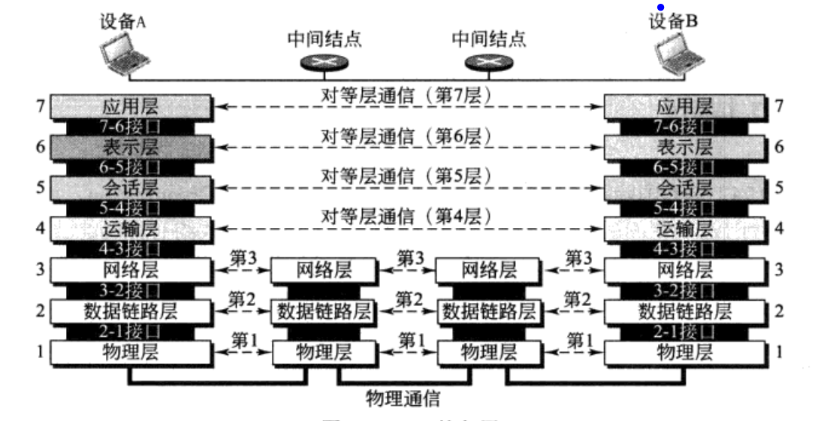
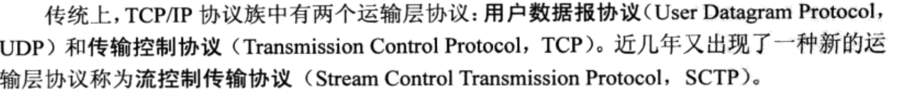
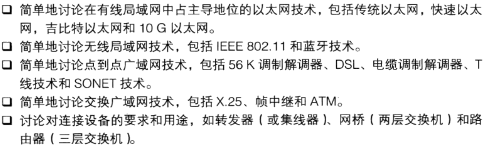
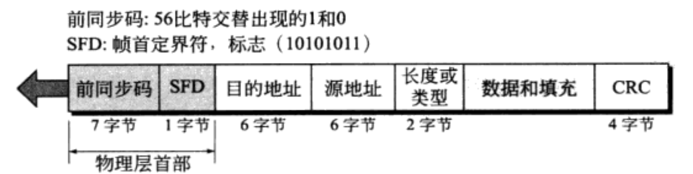
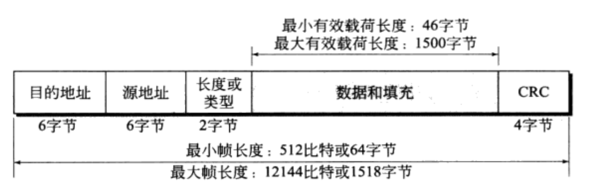

# TCP/IP协议族
## 第二章-OSI模型和TCP/IP协议族
### 2.1 OSI模型
>- OSI是一个模型，ISO是一个组织（International Standards Organization）

> - 物理层：负责把逐个的比特从一跳移动下一跳，定义了设备与传输媒体之间的接口特性，物理层的数据由一串没有任何解释解释的比特流组成，发送
> 时候，比特流必须进行编码变成信号-电或者光信号，传输速率：每秒发送的比特数，比特的同步是由发送设备和接收设备的时钟来保证的。传输方式：
> 单工方式、半双工方式、全双工方式（两个设备同时都可以同一时间进行发送和接收数据）物理拓扑：网状拓扑、星状拓扑、环状拓扑。总线拓扑。
> 线路配置：点对点配置、多点配置。
> - 数据链路层：把物理层转换成可靠的链路，组帧：数据链路层把从网络层收到的比特流划分为可以处理的数据单元，称之为帧，如果需要发送给另外
> 一个系统，需要再帧的首部指明发送方和接收方-此处是物理地址，也就是mac地址。还存在流量控制和差错控制（在帧的末尾增加一个尾部来实现的）。
> - 网络层：负责把分组从源点交付到终点，可能跨越多个网络。网络层收到从上层传来的分组附加一个首部，包含发送方和接收方逻辑地址，并且需要
> 经过路由器的路由选择到达目的地。
> - 传输层：负责完整报文端对端的交付，也就是进程与进程之间的交付，为了找到指定的进程通过端口号进行服务点编址，一个报文可能被分割成多个报文段
> 进行传输，涉及到了分组与重装，传输层可以面向连接的，也可以使面向无连接的，还有流量控制和差错控制。
> - 会话层：用于简历、维持并同步正在通信系统之间的交交付。
> - 表示层：考虑到两个系统多交换信息的语义和语法，涉及到了转换、加密和压缩。
> - 应用层：给用户提供了一些功能，文件传输、邮件服务等、
### 2.2 TCP/IP协议族
> - 时间出现的比OSI要早，更早的占领了市场，并且更符合实际。
> - 物理层：传输比特流，存在标准和专用的协议
> - 数据链路层：帧。
> - 网络层： 数据报（datagram）。
> - 传输层： 报文、分组、用户数据包。在传输层中报文会被拆分成多个数据报-分组，由网络层进行传输，到达目的地之后需要进行重装。
> 
> - 应用层：相当于OSI中的会话层、表示层和应用层的组合。
### 2.3 编址
> - 物理地址，称为链路地址，也就是mac地址，以太网中使用网络接口卡中的6字节的物理地址。
> - 逻辑地址，是一个32位的地址，可以唯一标志连接在因特网上面的主机，也就是IP地址，在进行网络层传输过程中，物理地址会逐跳改变，但是逻辑地址保持不变。
> - 端口地址：端口。
> - 特定应用地址：域名，邮箱域名或者网站域名。
## 第三章 底层技术
> - 本章的重点

### 3.1 IEEE标准
> - ISO 8803国家标准-IEEE将数据链路层进一步划分为两个子层：逻辑链路层、媒体接入控制，
### 3.2 帧的格式
> - 物理层中数据格式

> - 前同步吗：7个字节，是在物理层加上去的，作用是提醒系统有帧到来并且使它与输入定时同步。
> - 帧定界符：1字节，作为帧开始的信号。帧定界符也是右物理层添加的。
> - 目的地址和源地址：包含6个字节，是物理地址。
> - 长度/类型：2个字节可以定义为长度或者类型字段，在IEEE中定义为长度字段比较常见，
> - 数据：数据字段携带的是上层协议封装的数据，他的最小长度是46字节，最大长度是1500字节。
> - CRC：四个字节，最后包含的是差错检测信息。
> - 帧格式

> - 最小化长度是由CSMA/CD能够正确操作而要求的，一个以太网帧最小需要512比特或64字节，加上目的地址+源地址+长度+CRC=18字节，顾数据+填充最小为
> 46字节，如果数据少于46字节的话，就会进行填充。帧的最大长度1518个字节，减去固定的18字节，数据最大为1500字节。
### 3.3 编址
> - mac地址：采用16进制表示，并用分割号:进行分隔。
> - 如何区分单播地址和多播地址，如果目的地址的地址的第一个字节的最低位是0表示单播地址，如果是1表示多播地址，如果全部是ffffffff则是广播地址。
> - 
### 3.4 以太网发展历程

