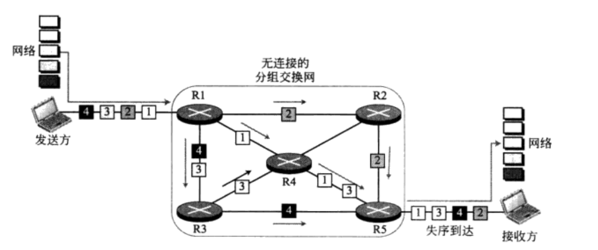

# TCP/IP协议族
## 第二章-OSI模型和TCP/IP协议族
### 2.1 OSI模型
>- OSI是一个模型，ISO是一个组织（International Standards Organization）

> - 物理层：负责把逐个的比特从一跳移动下一跳，定义了设备与传输媒体之间的接口特性，物理层的数据由一串没有任何解释解释的比特流组成，发送
> 时候，比特流必须进行编码变成信号-电或者光信号，传输速率：每秒发送的比特数，比特的同步是由发送设备和接收设备的时钟来保证的。传输方式：
> 单工方式、半双工方式、全双工方式（两个设备同时都可以同一时间进行发送和接收数据）物理拓扑：网状拓扑、星状拓扑、环状拓扑。总线拓扑。
> 线路配置：点对点配置、多点配置。
> - 数据链路层：把物理层转换成可靠的链路，组帧：数据链路层把从网络层收到的比特流划分为可以处理的数据单元，称之为帧，如果需要发送给另外
> 一个系统，需要再帧的首部指明发送方和接收方-此处是物理地址，也就是mac地址。还存在流量控制和差错控制（在帧的末尾增加一个尾部来实现的）。
> - 网络层：负责把分组从源点交付到终点，可能跨越多个网络。网络层收到从上层传来的分组附加一个首部，包含发送方和接收方逻辑地址，并且需要
> 经过路由器的路由选择到达目的地。
> - 传输层：负责完整报文端对端的交付，也就是进程与进程之间的交付，为了找到指定的进程通过端口号进行服务点编址，一个报文可能被分割成多个报文段
> 进行传输，涉及到了分组与重装，传输层可以面向连接的，也可以使面向无连接的，还有流量控制和差错控制。
> - 会话层：用于简历、维持并同步正在通信系统之间的交交付。
> - 表示层：考虑到两个系统多交换信息的语义和语法，涉及到了转换、加密和压缩。
> - 应用层：给用户提供了一些功能，文件传输、邮件服务等、
### 2.2 TCP/IP协议族
> - 时间出现的比OSI要早，更早的占领了市场，并且更符合实际。
> - 物理层：传输比特流，存在标准和专用的协议
> - 数据链路层：帧。
> - 网络层： 数据报（datagram）。
> - 传输层： 报文、分组、用户数据包。在传输层中报文会被拆分成多个数据报-分组，由网络层进行传输，到达目的地之后需要进行重装。
> 
> - 应用层：相当于OSI中的会话层、表示层和应用层的组合。
### 2.3 编址
> - 物理地址，称为链路地址，也就是mac地址，以太网中使用网络接口卡中的6字节的物理地址。
> - 逻辑地址，是一个32位的地址，可以唯一标志连接在因特网上面的主机，也就是IP地址，在进行网络层传输过程中，物理地址会逐跳改变，但是逻辑地址保持不变。
> - 端口地址：端口。
> - 特定应用地址：域名，邮箱域名或者网站域名。
## 第三章 底层技术
> - 本章的重点

### 3.1 IEEE标准
> - ISO 8803国家标准-IEEE将数据链路层进一步划分为两个子层：逻辑链路层、媒体接入控制，
### 3.2 帧的格式
> - 物理层中数据格式

> - 前同步吗：7个字节，是在物理层加上去的，作用是提醒系统有帧到来并且使它与输入定时同步。
> - 帧定界符：1字节，作为帧开始的信号。帧定界符也是右物理层添加的。
> - 目的地址和源地址：包含6个字节，是物理地址。
> - 长度/类型：2个字节可以定义为长度或者类型字段，在IEEE中定义为长度字段比较常见，
> - 数据：数据字段携带的是上层协议封装的数据，他的最小长度是46字节，最大长度是1500字节。
> - CRC：四个字节，最后包含的是差错检测信息。
> - 帧格式

> - 最小化长度是由CSMA/CD能够正确操作而要求的，一个以太网帧最小需要512比特或64字节，加上目的地址+源地址+长度+CRC=18字节，顾数据+填充最小为
> 46字节，如果数据少于46字节的话，就会进行填充。帧的最大长度1518个字节，减去固定的18字节，数据最大为1500字节。
### 3.3 编址
> - mac地址：采用16进制表示，并用分割号:进行分隔。
> - 如何区分单播地址和多播地址，如果目的地址的地址的第一个字节的最低位是0表示单播地址，如果是1表示多播地址，如果全部是ffffffff则是广播地址。
> - 
### 3.4 以太网发展历程

> - 标准以太网：总线局域网，数据率是10Mbps，接入方法采用CSMA/CD,带有碰撞检测的载波监听多点接入，传送前先听后讲。
> - 最小帧长：要使得CSMA/CD正常工作，必须限制帧的长度，要保证发送端发送帧的最后一个比特之前必须判断是否发生碰撞，若发生碰撞则放弃此次传输，若
> 不发生碰撞，此站将不会保留帧的副本，同时也不会在监听是否发生了碰撞，因此帧的传输时间必须是最大传播时间的两倍（传输时间是指发送时间，传播时间是
    > 指一个站点传输到另一个站点的时间）。

> - 快速以太网：802.3u，传输速率为100Mps，基本与标准以太网要求相同，
> - 吉比特以太网：1000Mps，

### 3.5 无线局域网
> - IEEE 802.11是无线局域网，包含了物理层和数据链路层，体系结构：基本服务集：ap为基站，接入点，还有不需要基站，bss称之为基础结构网络
    > 扩展的服务集：由两个或者多个AP的BSS构成。
> - MAC子层：基本CSMA/CA碰撞避免你的载波监听多点接入，无线局域网不使用CSMA/CD的三个原因：1，如果要进行碰撞检测的话就意味着昂贵的费用以及
> 以及对带宽的需求增加、2，由于存在隐藏站可能检测不到碰撞，3，站和站之间的距离可能会很远，信号会衰减的话，可能使一端无法听到另一端发生的碰撞。
> CSMA/CA：源站监听到信道空闲之后，等一段分布帧间距时间之后，发送一个RST控制帧，目的站接收到了之后等待短帧间距之后向源站发送一个CTS允许的控制帧，源站等一会之后开始发送数据。
> - 无线环境非常嘈杂，被破坏的必须重传，因此协议推荐使用分片的方法将大的帧分割成较小的帧

> FC：帧控制，两个字节，表示帧的类型以及一些控制信息，D：用于设置NAV的值，地址：共有四个地址段，都是6个字节，序列号控制：sc：该字段定义流量控制使用的帧
> 序号，帧主体：包含的字段取决于FC字段中的类型和子类型，fcs：4字节包含差错检测。
> 无线局域网中有三种帧：管理帧，控制帧，数据帧
> - 编址机制：

> CSMA/CS的握手帧可以防止隐藏站带来的碰撞
 
> - 蓝牙：蓝牙局域网是一种设计于连接具有不同功能的设备的无线局域网络。
### 3.6点到点广域网
> - 56K调制解调器

> - DSL技术：使用本地用户线来支持高速数字通信的一种最由前途的技术。
> - PPP：点到点协议，只有物理层和数据链路层。
### 3.7交换广域网
### 3.8连接设备
> - 转发器（集线器）：转发数据，有损耗，可以放大加强之后在发送出去，没有过滤功能、
> - 网桥（交换机）：可以检测帧中的mac地址，有过滤功能，网桥有一张表，用于过滤判决，网桥不改变帧中的mac地址
> - 路由器：作用在网络层，路由器会改变收到的分组的MAC地址，因为MAC地址仅在本地具有判决意义。

## 第四章网络层简介

> - 电路交换：在报文传输之前，源点和终点必须建立一条物理电路，在电路交换中，完整的，没有被分割成分组的报文从源点发送到了终点。
> - 分组交换：来自上层的报文被分割成便于管理的一个个分组，在由网络发送这些分组。分组交换网为分组选择路由的方式有两种：数据报方式、虚电路方式、
> - 报文需要再源点被分割成便于管理的分组，然后逐个发送，终点接收到的数据报经过组装后重新生成原始的报文。
> - 无连接服务：在无连接交换网中转发的判决的依据是该分组的目的地址，一个报文被分割之后就被发送出去，该报文的所有分组所走的路径可能不相同。
> 
> - 面向连接服务：属于同一个报文的所有分组之间是有关联的，会建立一个虚电路，还会有一个虚标号，转发的判决的依据是该分组的标号
> - 数据从网络层到物理层传输过程！

> - 差错控制。
## 第五章IPV4地址
> - IPV4地址：IPV4地址的长度是32位
> - 地址编类：分类编址、无分类编址，D类地址通常用来多波，
