# 图解HTTP
## 第一章 了解WEB及网络的基础
### 1.1 使用Http协议访问Web
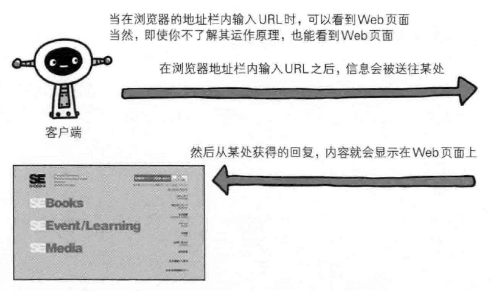
### 1.2 Http的诞生
> - http诞生于需要知识共享，伴随着http诞生之后，浏览器随之火爆，微软与网景浏览器争斗最终以微软胜利告终。http在1996年5月版本正式任命为http/1.0。
> http是在TCP/IP基础之上起作用的。
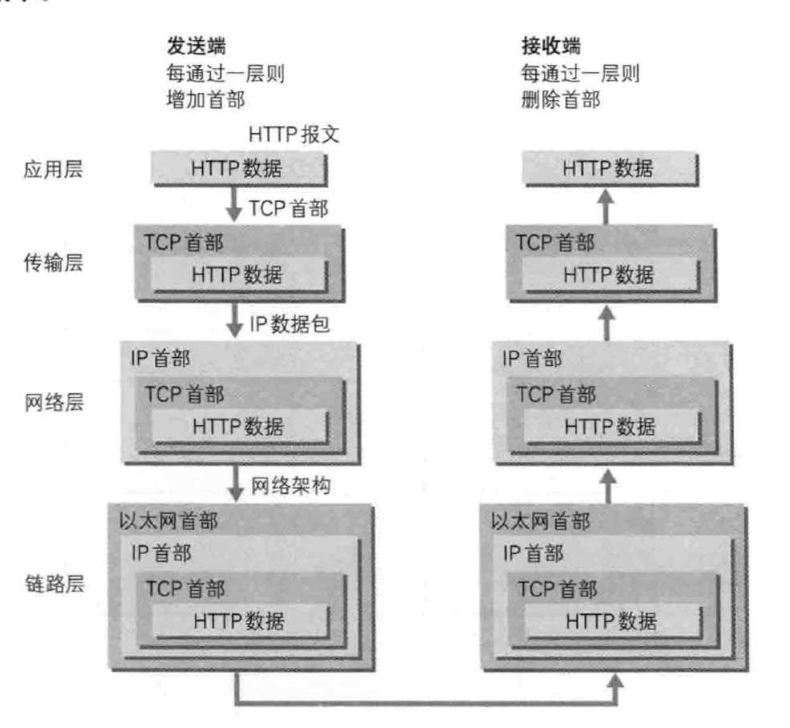
> - 与http密不可分的三个协议:IP、TCP和DNS、
> - 负责传输的IP协议：ip（internet protocol）网际层协议，把各种数据包传送给对方，中间会涉及到跨网段传输，用到ARP技术，奖逻辑网络地址转化昵称mac地址。
> - 确保可靠性传输的TCP协议：TCP位于传输层，提供可靠的字节流服务，TCP协议会通过三次握手建立连接。
> - 负责域名解析的DNS服务：DNS将域名转换成IP地址。
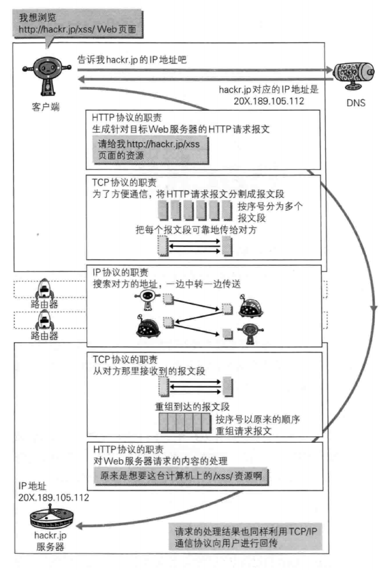
> - URL：统一资源定位符，URI：统一资源标识。
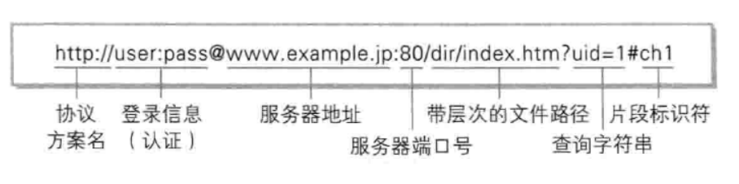
## 第二章 简单的HTTP协议
> - HTTP是不保存状态的协议，为了实现保存状态功能于是引入了Cookie技术。
> - method方法：get：获取资源，post：传输实体主主体，put：传输文件，head：获取报文首部，用于确认URI的有效性以及资源的更新日期时间等，delete：删除文件，put和
> delete不带验证机制，所以一般也不会使用delete方法，options：询问支持方法，trace：追踪路径，让web服务器将之前的请求通信环回给客户端的方法，容易引发站点追踪，不常用。
> connect：要求用隧道协议连接代理，connect方法要求在于代理服务器通信时建立隧道，实现用是隧道协议进行TCP通信。主要用SSL和RLS协议把通信内容加密后经网络隧道传输。
> - http1.0和http1.1所支持的方法
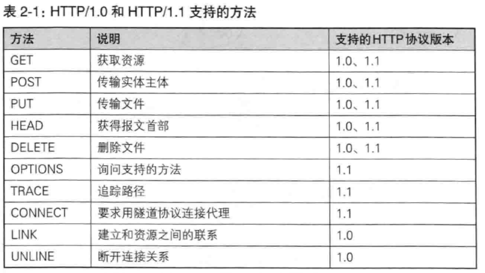 
> - 非持久连接：在http1.0中默认是非持久化连接的，但是可以设置为持久连接。
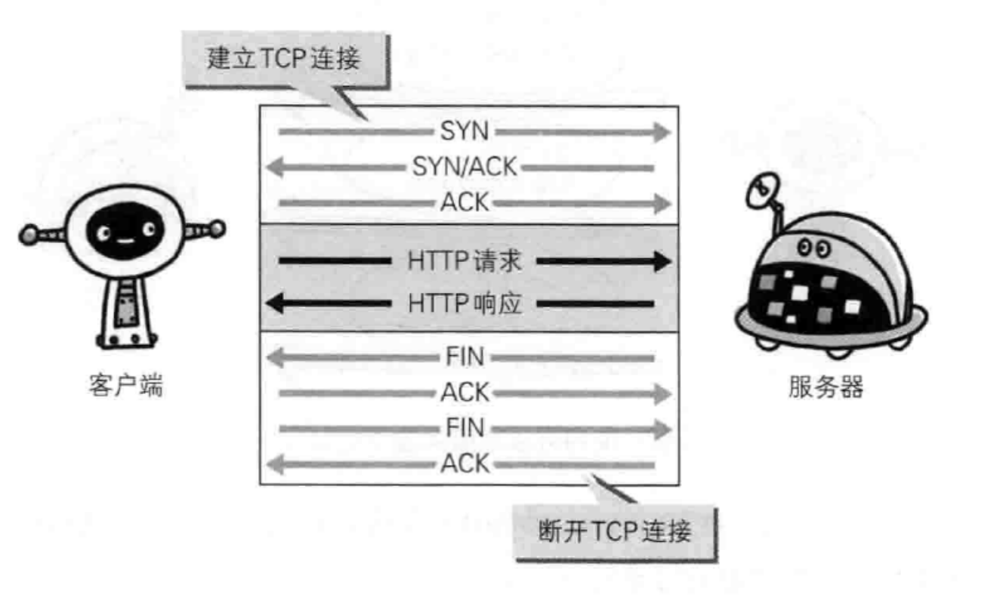
> - 持久连接：在http1.1中默认是持久化连接的。
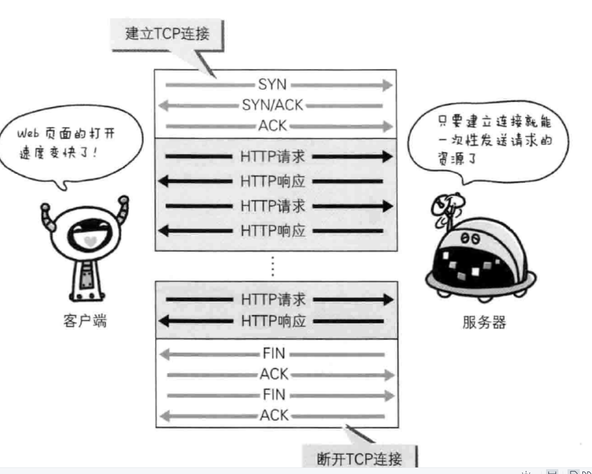
> - 管线化：持久化连接的存在使得管线化存在了可能，不用等待响应就可以直接发送下一个请求。
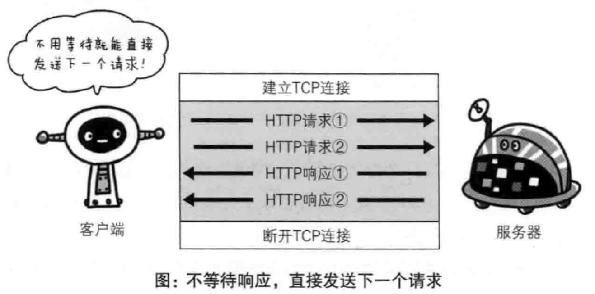
> - Cookie进行状态管理：cookie技术通过请求和响应报文中写入cookie信息来控制客户端的状态。1，cookie会根据从服务器发送的响应报文内的叫做Set-Cookie的首部字段信息，通知
> 客户端保存cookie,2，当下次客户端在往服务器发送请求时候，客户端会主动在请求报文中添加cookie值后发送,3，服务器接收到客户端发来的cookie之后，会查询究竟是哪个客户端发来的
> 连接请求。
## 第三章 HTTP报文内的HTTP信息
> - HTTP报文是由多行（CR+LF作换行符）数据构成的字符串文本，HTTP报文可以分为报文首部和报文主体两部分，两者起初是由（CR+LF）划分的，通常并不一定有报文主体。
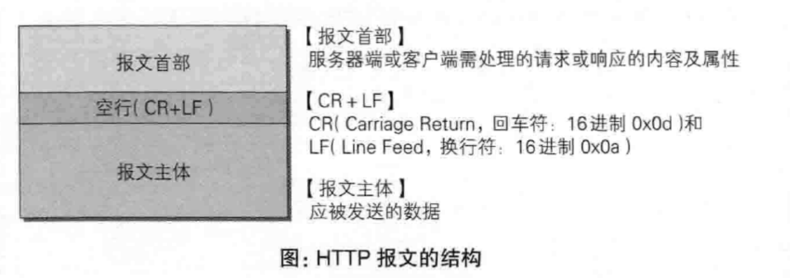
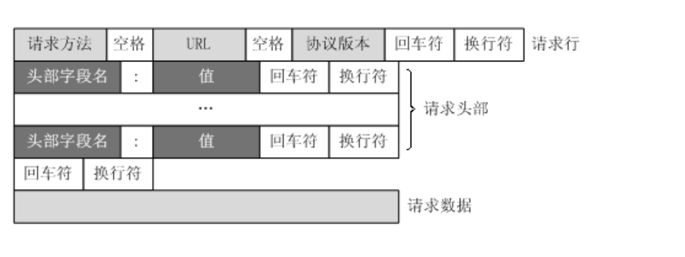
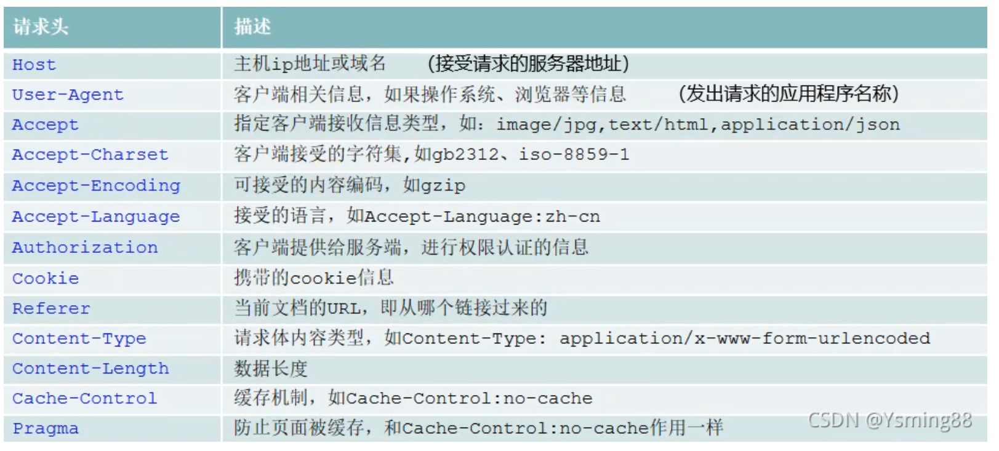
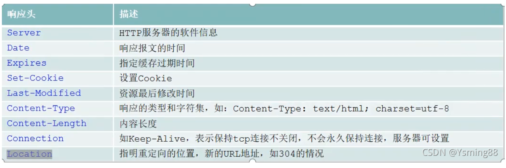
> - 请求报文和响应报文
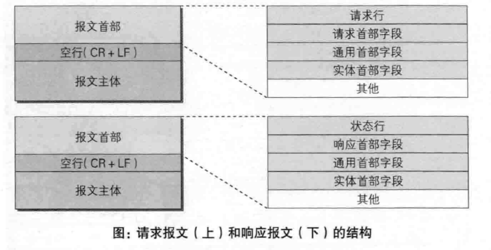
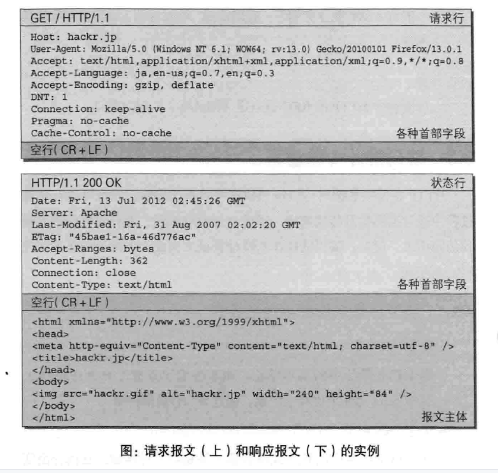
> - 报文中的参数解释：请求行：包含请求方法、请求URI和HTTP版本。状态行：响应状态码、原因短语和HTTP版本。首部字段：一般由通信首部、请求首部、响应首部和实体首部。
> - 编码提升传输速率：类似于发送邮件中内增加附件时，为了使邮件变小，会使用ZIP压缩文件之后在进行传输。HTTP协议中存在内容编码也有类似大的功能，进行实体内容编码，
> 客服端负责解码，常用的内容编码：gzip（GNU zip）、compress（UNIX系统中的标准压缩）、deflate（zlib）、identity（不进行编码）。分割发送的分块传输编码：
> 把实体主体分块的功能称为分块传输编码，分块传输编码分为多个块，每个块都会用十六进制来标记块的大小，最后一个块会用“0（CR+LF）”来标记。
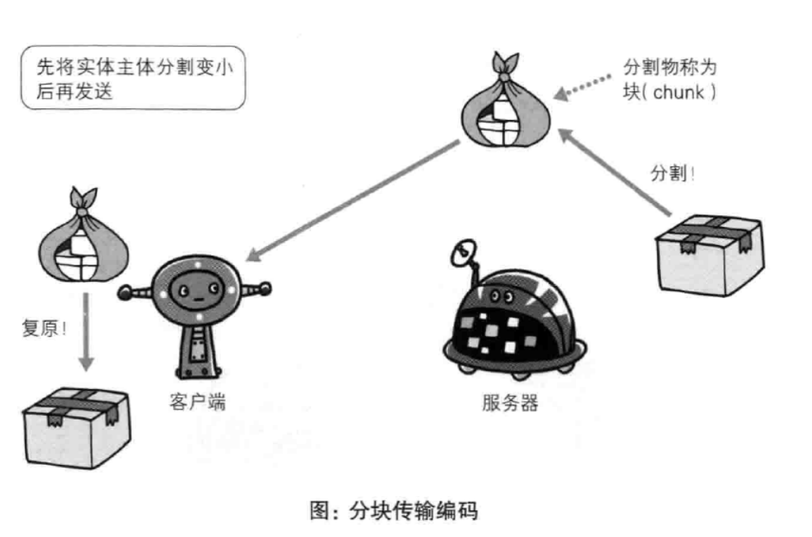
> - 发送多种数据的多部分对象集合：类似于邮件传输的MIME（Multipurpose Internet Mail Extemsions）功能，Http也采用了多部分对象集合，发送一个报文时候可以含有
> 多个类型实体，通常是图片或者文件上传时候使用：multipart/form-data用于web表单上传文件使用、multipart/byteranges状态码206响应报文包含多个范围内容时候使用、
> multipart/form-data、multipart/by，在使用字符串来分割实体之前要插入“--”标记进行分割。
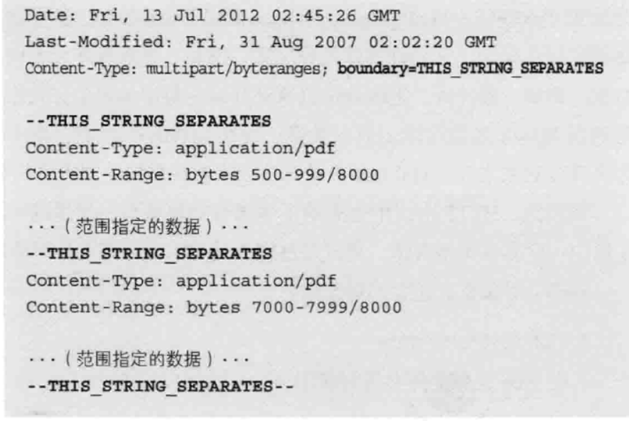
> - 获取部分内容的请求范围：可以获取资源的部分内容，适用于断开之后从接受了资源处开始继续请求资源，指定范围请求，Range Request，range可以支持多重参数。
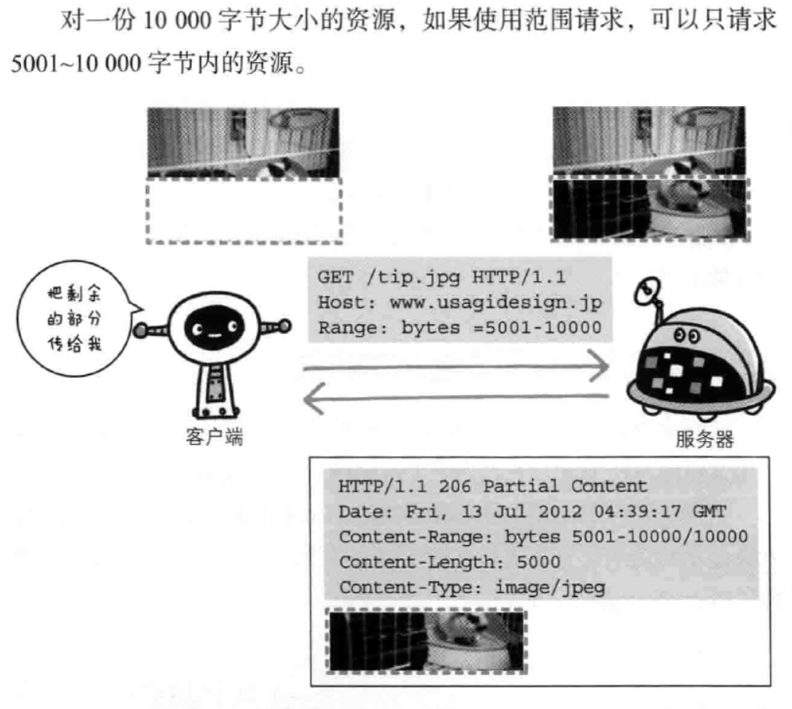
> - 内容协商（Content Negotiation）：返回最合适的内容，涉及到浏览器默认语言、字符集、编码等设置，请求服务器的会返回最适合的内容：Accept、Accept-Charset、
> Accept-Encoding、Accept-Language、Content-Language。内容协商技术：服务器驱动协商：由服务器进行内容协商、客户端驱动协商：由客户端进行内容协商的方式，手动选择、
> 透明协商：由服务器和客户端驱动的结合体，
## 第四章 返回结构的HTTP状态码
> - 状态码告知了服务端返回的请求结果，状态码的类别：
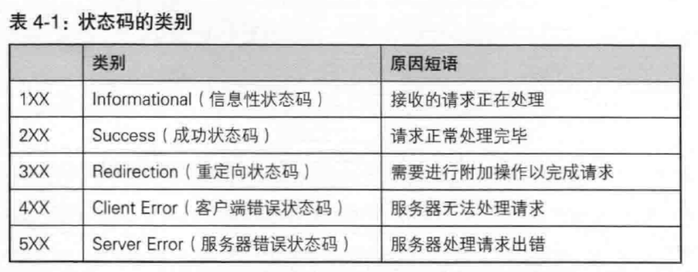 
> - 2XX：200（正常返回）、204（No Content，请求得到正常处理，返回的响应报文不含实体的主体部分，浏览器页面不发生更新）、206（Partial Content该状态码表示
    > 对客户端进行了范围请求）
> - 3XX：301（Move Permanently永久性重定向）
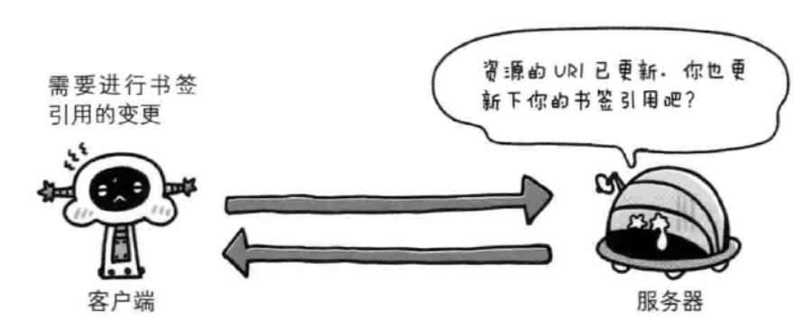
> 302（Found临时性重定向，该状态码请求的资源已被分配了新的URI，希望本用户本次能使用新的URI访问），302（See Other该状态码请求对应的资源存在另一个URI，应该使用
    > get的方法获得资源）
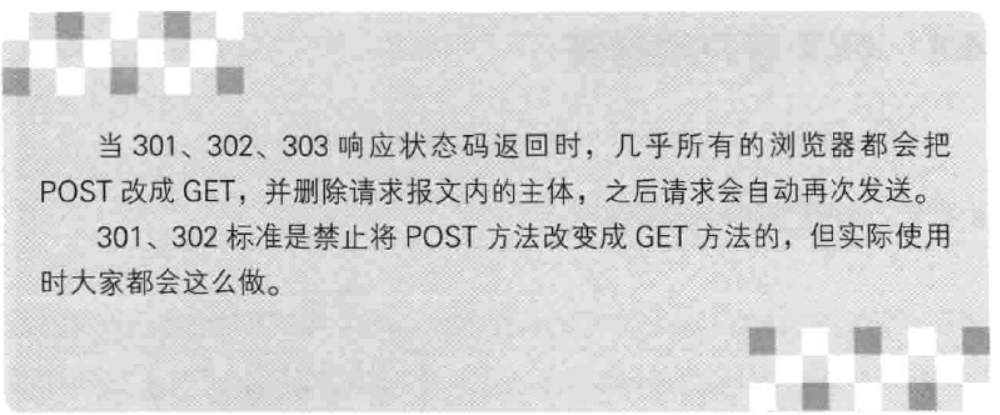
> 304（Not Modified表示客户端发送附带条件的请求时，服务器允许访问资源，但为满足条件）、307（Temporary Redirect临时重定向）
> - 4XX：客户端出现了问题，400（Bad Request表示请求报文存在语法错误）、401（Unauthorized，表示发送的请求需要通过HTTP认证（BASIC认证、DIGEST认证）的认证信息）
> 403（Forbidden，服务器拒绝访问请求）、404（Not Found服务器没有请求的资源）
> - 5XX：500（Internal Server Error服务器未知的错误）、503（Service Unavailable表明服务器暂处于超载负荷或者正在停机维修）
## 第五章 与HTTP协作的Web服务器
> - 代理：具有转发功能的应用程序，有缓存代理（可以将资源的副本缓存在代理服务器上面）和透明代理（不对报文做任何的加工）
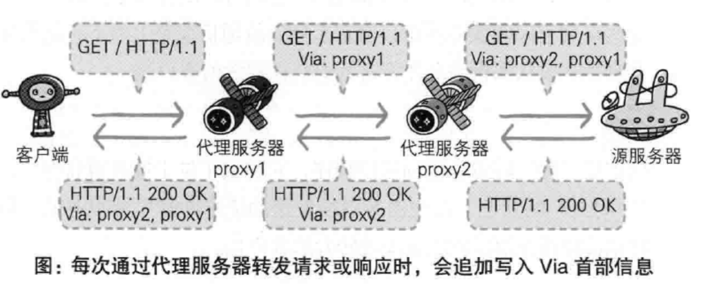
> - 网关：网关是转发其他服务器通信数据的服务器，利用网关可以由HTTP请求转换成其他协议通信，利用网关可以提高通信的安全，因为可以在客服端和网关通信链路上面加密以确保连接
> 的安全。比如网关可以连接数据库使用sql语句查询。
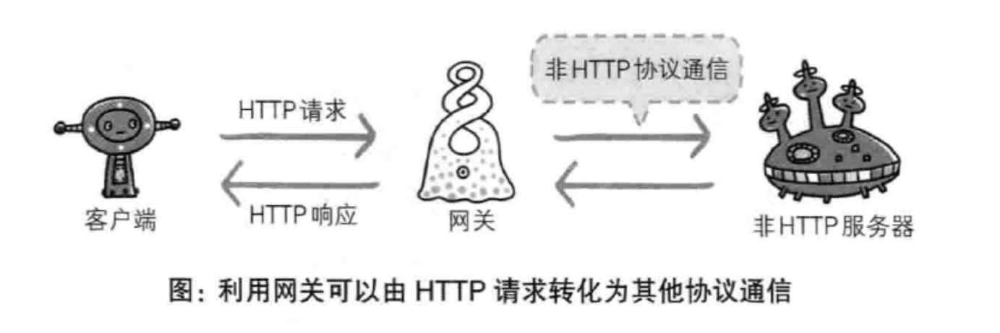
> - 隧道：隧道可按要求建立起一条与其他服务器的通信线路，届时使用SSL等加密手段进行通信。隧道的目的是确保客户端与服务器进行安全通信
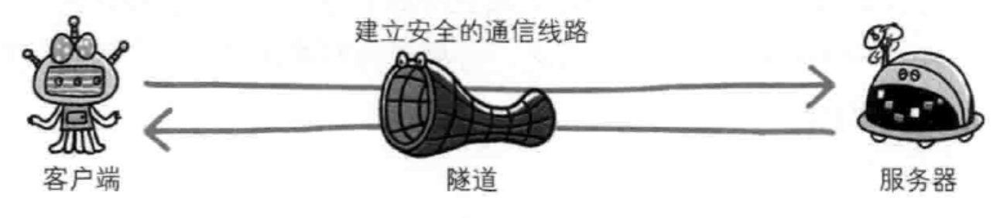
> - 确保资源的缓存：缓存服务器，客户端会直接获取缓存服务器上面的数据，客户端缓存：存储在浏览器本地。
## 第六章 HTTP首部
> - 在HTTP协议通信交互中使用的首部字段，不限于RFC2616中定义的47中首部字段，还有Cookie、setCookie和Content-Disposition德国在其它RFC中定义的首部字段。
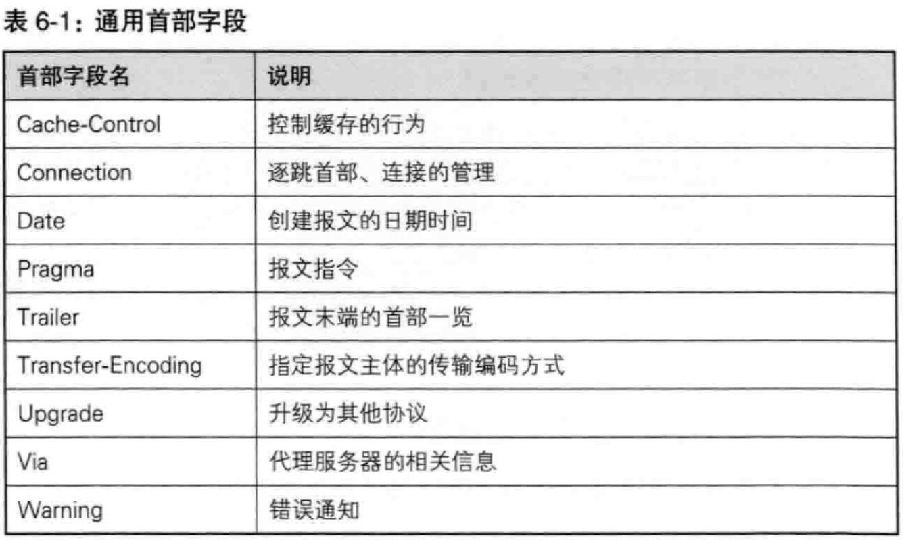
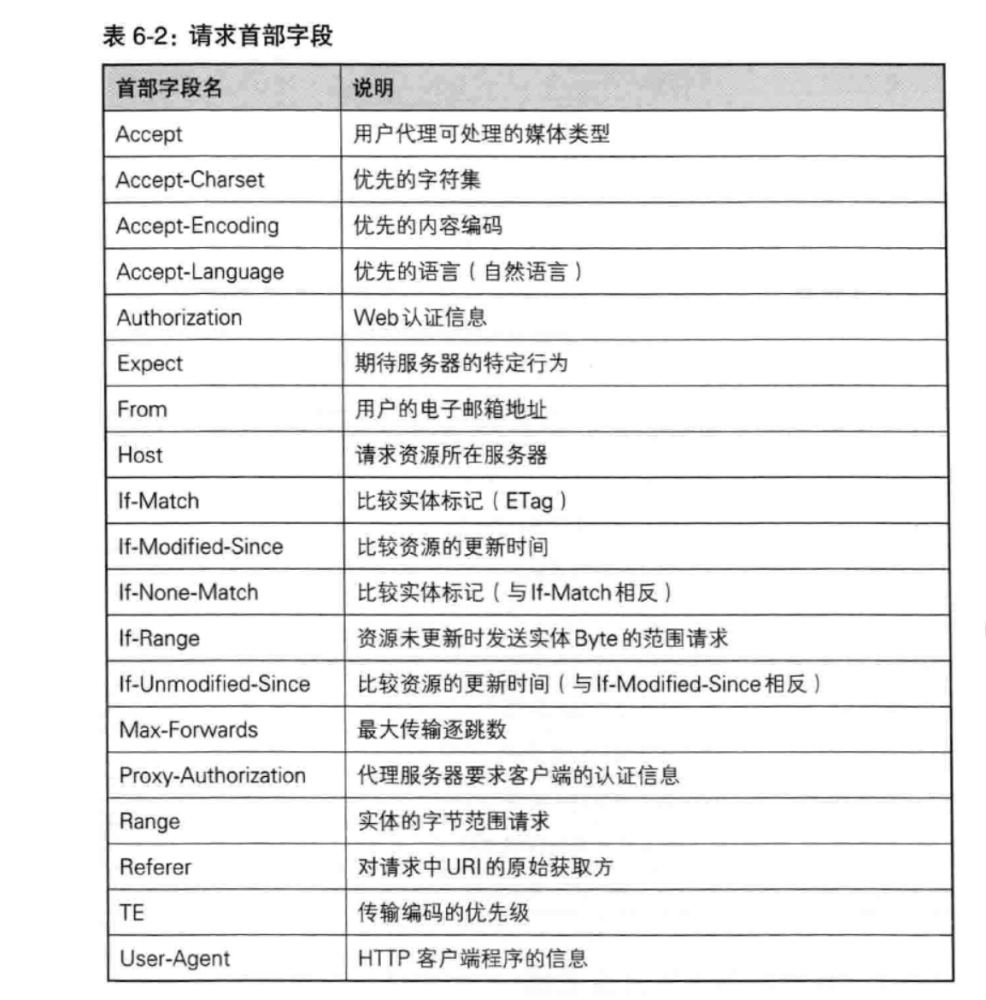
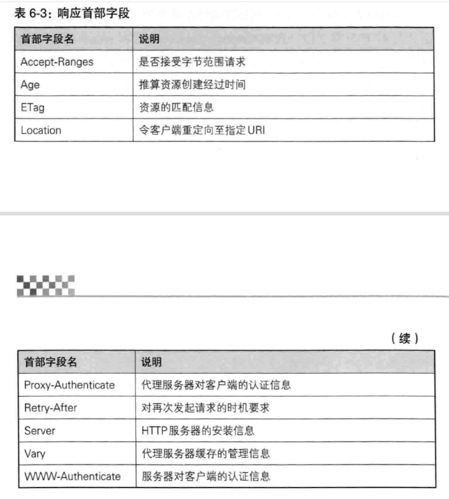
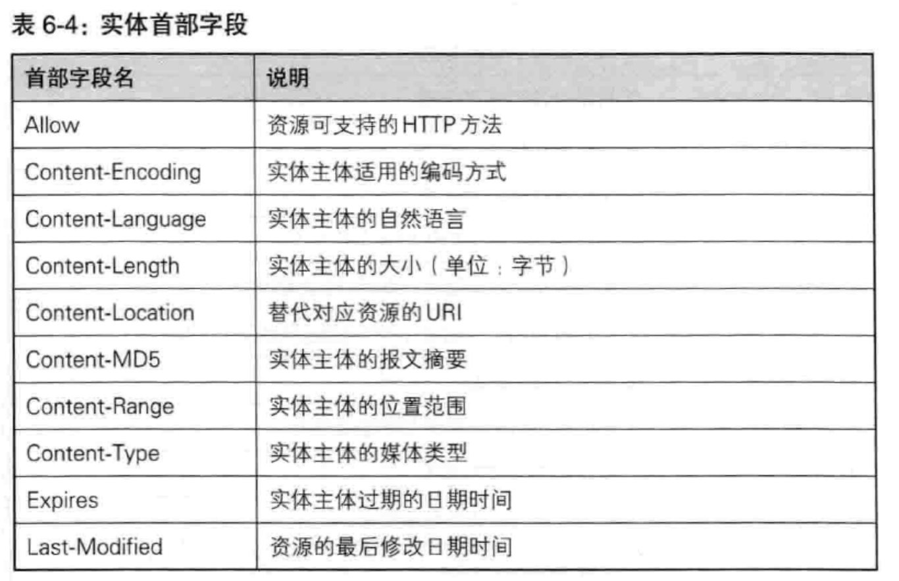
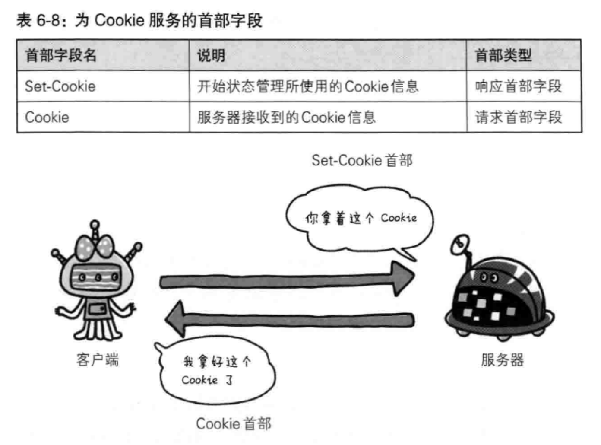
> - HTTP首部字段将定义成缓存代理（End-to-end Header）和非缓存代理(Hop-by-hop Header)的行为
